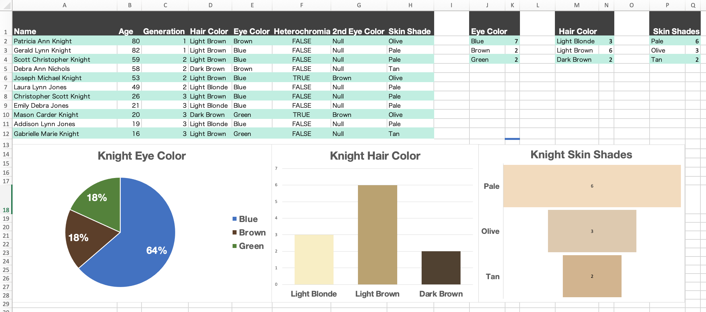
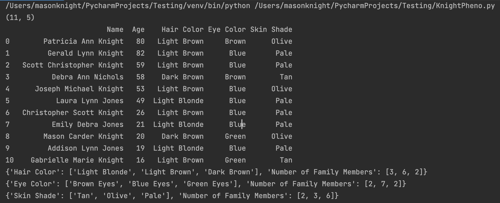
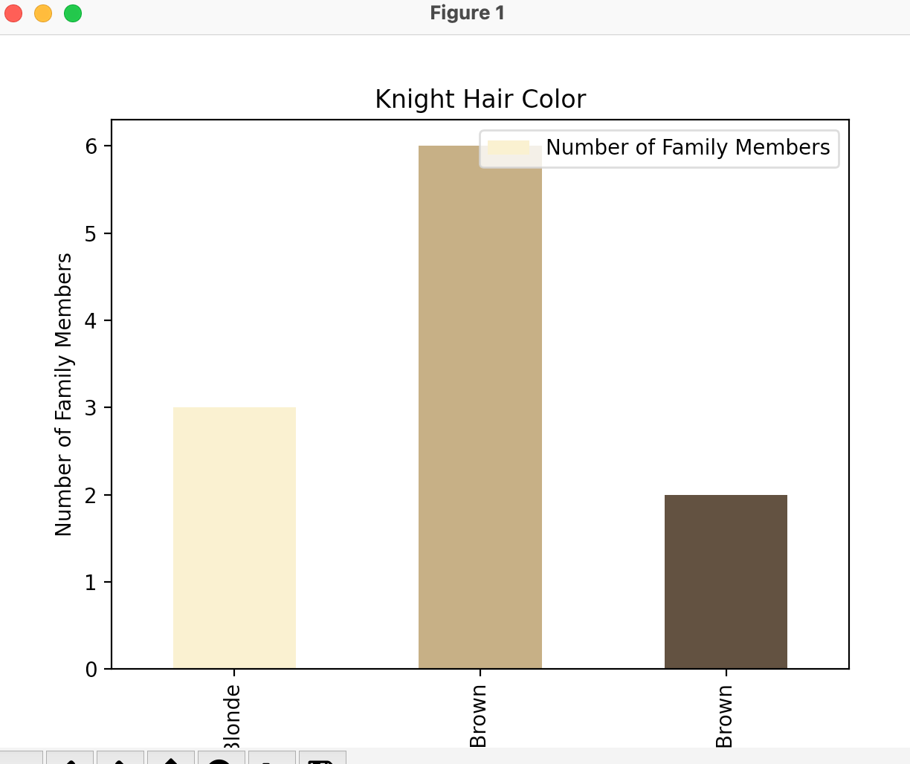
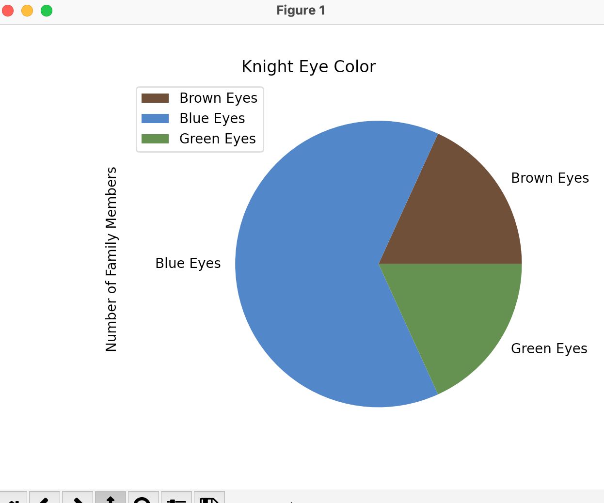
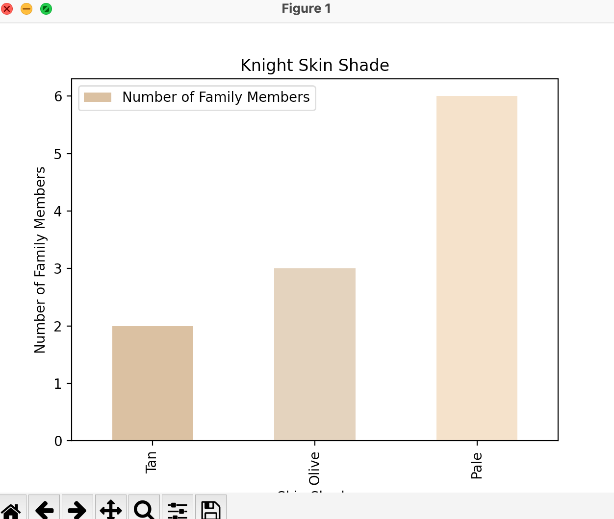

# KnightPhenotype
First attempt at Data Analysis.
I created a csv via Excel that listed my relatives on my fathers side. I mapped out each of our hair color, eye color, and skin shades. I then visualized the data within Excel. I then attempted to repeat the same thing through Python with Pandas and Matplotlib.

Here is the Excel view.

Here is the data running on Python.

Here is the Hair Plot.

Here is the Eye Plot.

Here is the Skin Plot.

